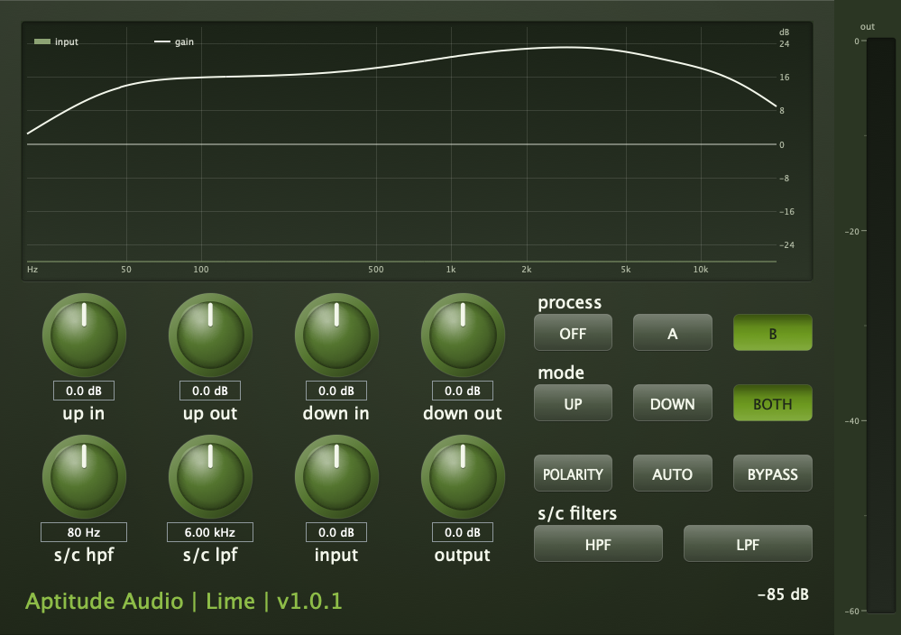

# Lime

**A spectral companding dynamics processor — per-bin compression one way, its exact
complement the other — built on a classic noise reduction architecture.**

[](https://github.com/baintonaj/lime/actions/workflows/ci.yml)

AU and VST3 for macOS. 64-bit double precision throughout. C++20, JUCE 9.



---

## What it is

Lime is a two-sided spectral dynamics unit. The forward pass compresses the signal's
dynamic range from both ends at once — quiet detail is lifted, extremes near saturation
are eased — and the reverse pass is its exact complement, expanding both back out. Run
the passes separately and it is an insert: **Up** mode is a many-band upward compressor
that raises low-level detail against everything around it, **Down** the matching
expander that pushes it back away. Run them as a pair around something lossy — tape, an
analogue insert, a codec round trip — and the compression rides the signal above the
channel's floor while the expansion takes the channel's noise down with it, which is the
noise-reduction duty the architecture was originally published for.

Two processes are provided:

| | Bands | Lift at low level |
|---|---|---|
| **A** | four fixed bands | 10 dB, rising to 15 dB at 15 kHz |
| **B** | five staggered stages across two spectral halves | 24 dB high, 16 dB low |

The interesting part is **B**, and the project's premise is what makes it unusual. The
published analogue design it follows builds its selectivity from a handful of wideband
filters and a sliding-band circuit. Here the analysis is a short-time Fourier transform and
**every bin carries its own stack of level-dependent stages** — per-bin thresholds, per-bin
time constants, per-bin end-stops. Where the original had five bands, this has thousands.

That premise turns out to be constrained in a way that is the most interesting finding in
the project. See [The central constraint](#the-central-constraint).

## Status

Version 1.0.1. Working and testable in a host, with every claim below backed by a check in
the six standalone suites — **684 checks passing**, runnable with one `ctest`.

One design target is **not** met: the encode → decode round trip should null to better than
−100 dB and manages about −80 dB on steady tones, −51 dB on dense broadband material near
reference level (−67 dB at −26 dB). The cause is measured, understood, and documented; the
fix is built and proven in isolation but not integrated. It is stated here rather than
omitted because it is a real shortfall. See [Open work](#open-work).

## Requirements

- macOS 10.13 or later; the build is universal (Apple silicon and Intel).
- CMake ≥ 3.22 (fetches JUCE 9.0.0 itself), or Xcode plus a JUCE 9 checkout for the
  Projucer route.
- The DSP library and its test suites need no JUCE at all — a C++20 compiler is enough.

## Latency

Lime is a lookahead spectral process and reports its latency to the host, which compensates
automatically. It is not small — two STFT analysis windows:

| Sample rate | Reported | |
|---|---|---|
| 44.1 kHz | 10240 samples | 232 ms |
| 48 kHz | 10240 samples | 213 ms |
| 88.2 / 96 kHz | 20480 samples | 232 / 213 ms |
| 176.4 / 192 kHz | 20480 samples | 116 / 107 ms |

Do not put it in a live monitoring path; see the [manual](MANUAL.md) for why the window is
the size it is.

---

## Building

CMake is the primary build and fetches JUCE 9.0.0 itself:

```sh
cmake -B build -DCMAKE_BUILD_TYPE=Release
cmake --build build --parallel
```

For a universal release binary add `-DCMAKE_OSX_ARCHITECTURES="arm64;x86_64"` to the
configure line; to build against an existing JUCE checkout instead of downloading one, add
`-DLIME_JUCE_SOURCE_DIR=/path/to/JUCE`.

The AU, VST3 and Standalone targets land under `build/Lime_artefacts/Release/`. Copy the two
plug-ins into `~/Library/Audio/Plug-Ins/Components` and `~/Library/Audio/Plug-Ins/VST3` to
install them, then validate the AU with `auval -v aufx Lim1 APTI`. Installing is left to you
deliberately: `auval` reports on whatever is installed, and a build that installs silently is
a build that can silently test the wrong binary.

The Projucer project `Lime/Lime.jucer` is kept as a secondary route for anyone working in
that ecosystem — resave it with a JUCE 9 Projucer and build the generated Xcode project.

## Running the tests

Everything under `Lime/Source/dsp` is free of JUCE, which is the point: the DSP builds and
runs without the plug-in wrapper, so it can be exercised directly and quickly.

```sh
ctest --test-dir build --output-on-failure
```

or, with no CMake and no JUCE, straight from a compiler:

```sh
cd Lime
for t in DspTests CalibrationTests TapeTests BarkTests AtypeTests PhaseTests; do
  clang++ -std=c++20 -O2 -I Source "Source/tests/$t.cpp" Source/dsp/*.cpp \
          -framework Accelerate -o "/tmp/$t" && "/tmp/$t"
done
```

| Suite | Checks | Covers |
|---|---|---|
| `DspTests` | 343 | transforms, WOLA, overlap-save, geometry, main path, fixed band, modulation control, sliding layer, gain slew, engine nulls, published curves, section resolution, section transitions, control smoothing, fractional delay, crossfade, delay-line repositioning, auto gain, the probes following the active direction, the display probe's torn-read guarantee, allocation-free processing, measured on-path latency |
| `CalibrationTests` | 81 | pink noise, calibration noise and tone, auto compare (mono and stereo), detector |
| `TapeTests` | 56 | hiss, saturation asymmetry, HF loss, modulation noise |
| `BarkTests` | 52 | Bark mapping, masking spread, exact all-pairs threshold |
| `PhaseTests` | 75 | phase rotation (library component): flat magnitude, constant rotation with frequency, exact transparency at zero |
| `AtypeTests` | 45 | the four-band process, its own nulls, overshoot |

Every number in these suites is a *measurement*, printed with its limit. Where a mechanism
was tried and found to be worse, the failing numbers are asserted too, so that a later change
which "fixes" it gets noticed rather than silently accepted.

---

## Repository layout

```
Lime/Source/dsp/          the whole process, JUCE-free and double throughout
Lime/Source/*.h,*.cpp     the plug-in wrapper and the panel
Lime/Source/tests/        six standalone test binaries
Lime/Lime.jucer           Projucer project (secondary; CMake is primary)
CMakeLists.txt            plug-in, DSP library and test suites
MANUAL.md                 the user manual
DESIGN.md                 the design record — every decision, every measurement
CHANGELOG.md              release history
docs/panel.png            the panel, photographed by the plug-in itself
```

The two reference papers the DSP was written against are **not in the repository** — they are
70 MB of scanned PDF, which every clone would pay for. They are cited in full in
[References](#references) and by section in the source comments, so any constant can be
checked against them by anyone with a copy.

`DESIGN.md` is the substantive document. It carries the reference specification extracted from
the source papers, every design decision with its reasoning, every measured reversal with the
numbers that forced it, and the negative results. If you are reading the code and wondering
why something is the way it is, the answer is in there.

## Architecture

```
                  ┌─ skew · antisaturation (biquads) ─────────────────┐  (main path)
                  │                                                    │
  input ─▶ split ─┼─ long-window WOLA ─▶ LF stages ─▶ iFFT ─────────── ┤
                  │                        ▲                           ├─▶ ± ─▶ out
                  └─ short-window WOLA ─▶ HF stages ─▶ iFFT ─▶ delay ──┘
                                           ▲                     + encode
                        MC1..MC8 ──────────┘                     − decode

  each stage:  per-bin fixed stack  ─┐
               sliding layer        ─┴─▶ restriction ─▶ gain-slew clamp
```

| File | Responsibility |
|---|---|
| `Fft64` | double real FFT; Accelerate `vDSP_*D` backend plus a portable fallback behind one interface |
| `Window`, `Wola64`, `OverlapSave64` | STFT engines — √Hann WOLA and exact overlap-save convolution |
| `Biquad64`, `FilterDesign` | the fixed networks: spectral skewing, antisaturation, and their exact inverses |
| `FixedBand` | per-bin staggered fixed band, dual control path and maximum selector |
| `SlidingLayer` | masking-based peak tracking and quasi-two-pole skirts |
| `SrStage` | one staggered stage: fixed band restricted by the sliding layer |
| `SrSideChain` | one spectral half — three stages above the 800 Hz split, two below, the split resolved onto log-spaced sections (settable in the library; the plug-in pins it at 2048) |
| `ModulationControl` | MC1 to MC8, the frequency-weighted control voltages |
| `GainSlew` | per-frame gain-slew clamp, standing in for analogue overshoot suppression |
| `Bark` | critical-band mapping and the masking spread function |
| `PhaseRotator` | constant phase rotation, 0 to 180 degrees, via a 90-degree phase-difference network — library component, not wired into the released plug-in |
| `FractionalDelay64` | sub-sample delay, third-order Lagrange — library component, not wired into the released plug-in |
| `Crossfade` | the shaped, finite ramp a change of process or mode fades across |
| `CompressionLaw` | the knee shared by the fixed band and the sliding layer |
| `SrEngine` | top level: main path, both halves, encode/decode/both, alignment |
| `AtypeEngine` | the four-band process on the shared dual-path core |
| `TapeChannel` | the modelled channel: hiss, saturation, HF loss, modulation noise |
| `Calibration` | calibration noise and tone, auto compare, the nick detector |
| `ControlSmoother` | the one pole every control reaches the signal path through |
| `ShelvingBank64` | 24-band exactly invertible time-domain gain — built, proven, not yet integrated |
| `SpectrumProbe` | wait-free triple-buffered spectrum snapshot for the panel |
| `DspMath` | the shared one-pole magnitude and frame-rate smoothing coefficient |

Channels are processed **independently and never linked**. The dual-path topology tolerates
channel-to-channel gain error well enough not to need it, and linking would mean one channel's
transients modulating the other's noise floor.

One assumption the DSP layer makes of its caller: denormals are flushed. The plug-in wrapper
runs every block under `juce::ScopedNoDenormals`; anyone embedding `dsp/` elsewhere should
arrange FTZ/DAZ the same way, or the smoothers' geometric decay toward silence will crawl
through denormal range.

### Double precision

`supportsDoublePrecisionProcessing()` returns true and `processBlock (AudioBuffer<double>&)`
is the real implementation. The float overload widens into a persistent double scratch buffer,
runs the same engine, and narrows on the way out, so behaviour is identical whatever the host
offers. There is no `float` anywhere under `dsp/`.

`juce::dsp::FFT` is float-only, which is why `Fft64` exists. Its two backends agree
to **−297 dB** on random input, and both agree with a Kahan-compensated naive DFT to −307 dB.

---

## The central constraint

This bounds what the architecture can achieve and is worth understanding before changing
anything. Measured on a bare pair of WOLAs with a **time-invariant** gain, so control state and
divergence are excluded entirely (a dedicated experiment, recorded in `DESIGN.md`; the suites
assert its consequence through the envelope-smoothing checks):

| Gain profile | Depth | Encode → decode residual |
|---|---|---|
| Smooth tilt across the band | 24 dB | **−125.9 dB** |
| Single-bin notch | 24 dB | **−15.9 dB** |
| Notch every 32 bins | 24 dB | **+4.0 dB** (error exceeds signal) |

A modified spectrum with abrupt bin-to-bin gain changes **is not the transform of any signal**,
so no decoder can undo it. This is the STFT consistency problem and it is structural rather
than a tuning matter.

So the per-bin *units* are fine; what cannot survive is a gain that jumps tens of dB between
neighbouring bins. The system addresses it by smoothing the level envelope by one critical band
*before the controls see it*, which keeps every bin's own threshold and time constants while
making the applied profile smooth by construction. That choice trades measurably against
detection accuracy, and both sides of the trade are recorded in `DESIGN.md`.

## Verification highlights

| Check | Achieved |
|---|---|
| WOLA perfect reconstruction | **−301 dB** worst case |
| Accelerate vs portable FFT | **−297 dB** |
| Main path encode → decode (biquad pair) | **−222 dB** worst rate, −232 best |
| Engine with the process off is an exact delay | below measurement |
| Staggered fixed-band total boost | **24.00 / 16.00 dB** |
| Steepest compression ratio | **1.77:1** high, 1.55:1 low |
| Published low-level curve, peak | **21.7 dB**, tapering 8.7 / 21.7 / 12.1 |
| Boost remaining at reference level | **0.12 dB** (the paper allows about 1) |
| Antisaturation at 25 Hz / 5 k / 10 k / 15 k | **9.97 / 1.73 / 5.96 / 10.06 dB** against 10 / 2 / 6 / 10 published |
| Time-domain shelving bank, gains randomised every block | **−234.1 dB** |
| Control smoothing settled at 75 ms | **0.950** at four sample rates |
| Round trip, steady tone | **−80.2 dB** *(target −100)* |
| Round trip, broadband at −26 dB | **−67.2 dB** *(target −100)* |
| Round trip, broadband near reference | **−50.9 dB** *(target −100)* |

## Working on the panel

In debug builds the panel can photograph itself, which is the only reason the UI is checkable
in a headless session (release builds compile the hook out):

```sh
LIME_SNAPSHOT=/tmp/ui.png build/Lime_artefacts/Debug/Standalone/Lime.app/Contents/MacOS/Lime
```

It renders through the same `paint()` calls the screen uses, into a CoreGraphics-backed image,
so what it shows is what is on screen rather than an approximation of it.

Two JUCE traps cost real time here and are documented at the top of `LimeGraphics.h`:
`Drawable::drawWithin` fits the *drawn content's* bounds rather than the viewBox, and JUCE does
not scale a radial gradient's radius by the bounding box unless it is written as a percentage.
Both silently render something plausible and wrong.

The palette lives in `LimeStyle.h` as **functions, not constants** — namespace-scope
`juce::Colour` objects derived from `juce::Colours::blue` are a static initialisation order bug,
and when it loses the race the panel comes out grey with the desktop visible through the plot.

## Open work

1. **Close the round-trip null.** `ShelvingBank64` realises the gain through 24 exactly
   invertible time-domain shelving sections and holds **−234 dB with its gains randomised every
   block** — the exact case that defeats an STFT. Integration was attempted three times and each
   attempt failed differently; the three results are recorded in `DESIGN.md` and together they say
   the coefficient sequences must match sample-for-sample *and* the loop from applied gain back
   to measured level must be broken. It carries a design decision: the *applied* gain would have
   24 degrees of freedom rather than one per bin, while the analysis stays per-bin. That narrows
   the original premise and should be chosen deliberately.

2. **Ports beyond macOS.** The DSP layer is portable (the Accelerate paths all carry scalar
   fallbacks and CI runs the suites), but the plug-in has only ever been built and validated on
   macOS. Windows and Linux are a CMake exporter away in principle and untested in practice.

## Documentation

| | |
|---|---|
| [`MANUAL.md`](MANUAL.md) | user manual — controls, workflows, troubleshooting |
| [`DESIGN.md`](DESIGN.md) | design record — specification, decisions, measurements, negative results |
| [`CHANGELOG.md`](CHANGELOG.md) | release history |

No PDFs are kept in the repository — the manual's source reads on the web and diffs like text,
where a PDF does neither. To render one:

```sh
pandoc MANUAL.md -o docs/Lime-Manual.pdf --pdf-engine=xelatex --toc --toc-depth=2 \
       -V geometry:margin=2.2cm -V colorlinks=true -V linkcolor=OliveGreen \
       -V fontsize=11pt --resource-path=.
```

## References

The process follows two published papers. Constants quoted in the source comments cite these
by section, so each one can be checked against the original in the AES E-Library:

- R. M. Dolby, "The Spectral Recording Process", *Journal of the Audio Engineering Society*,
  vol. 35, no. 3, pp. 99–118, 1987.
- R. M. Dolby, "An Audio Noise Reduction System", *Journal of the Audio Engineering Society*,
  vol. 15, no. 4, pp. 383–388, 1967.

Cited as prior art, for verifiability of the constants. Lime is an independent
reinterpretation of the published engineering: it is not a reissue or an emulation of any
product, it is not affiliated with, endorsed by, or derived from any manufacturer's hardware
or software, and any trademarks belong to their owners. Its controls and its two processes
are named on their own terms.

## Licence

Lime's own source is MIT — see [`LICENSE`](LICENSE). It builds against
[JUCE](https://juce.com), which is separately licensed under AGPLv3 or commercial terms;
anyone distributing binaries built from this repository takes on the corresponding JUCE
obligations. The DSP library under `Lime/Source/dsp/` has no JUCE dependency and is plain
MIT.

Copyright © 2026 Andy Bainton (Aptitude Audio).
